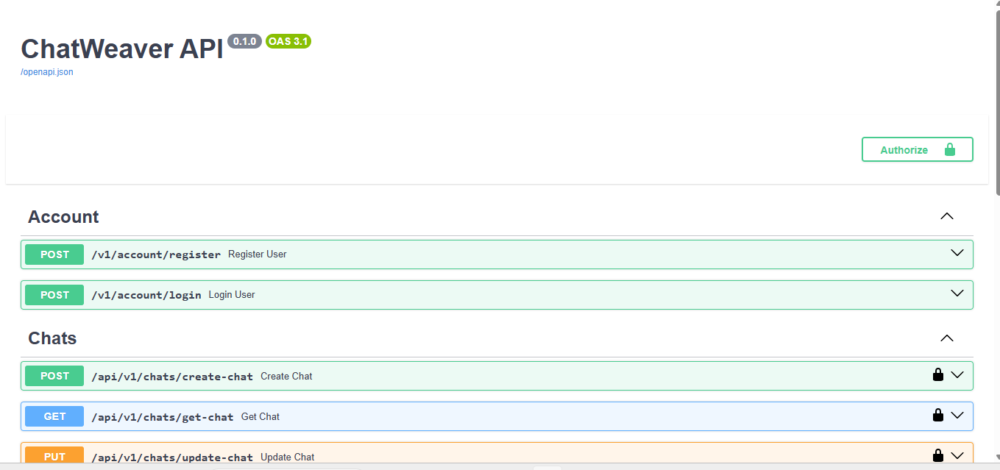

FORKCHART - Assistant Backend

This is a modular, scalable FastAPI backend for an AI Assistant application. It includes features for user account management, AI-powered chat services, and integration with MongoDB.

🚀 Features
🔐 User Account Module – Handles user models, schemas, and API views.

💬 Chat Module – Provides chat services and integration for AI-based interactions.

⚙️ Modular Architecture – Clean separation between models, schemas, views, and services.

🧩 MongoDB Integration – Uses MongoDB for data persistence.

⚡ FastAPI – High-performance API framework for Python 3.11+.

📦 uv Package Manager – Ultra-fast Python package installer.

new/
├── app/
│   ├── account/
│   │   ├── accountModel.py
│   │   ├── accountSchema.py
│   │   └── accountView.py
│   ├── chat/
│   │   ├── chatModel.py
│   │   ├── chatSchema.py
│   │   ├── chatView.py
│   │   └── chat_service.py
│   └── main.py
├── config.py                       # App configuration
├── db/
│   └── mongodb.py/postgresql.py    # MongoDB connection
├── run.py                          # Entry point for the app
└── requirment.txt                  # Project dependencies

🛠️ Installation
Clone the repository:

git clone https://github.com/shrishailwali/FORKCHART---Assistant-Backend.git
cd your-repo-name/new

⚙️ Configuration
Edit the config.py file to configure MongoDB settings and any environment variables required for your application.

🧪 Running the Application
Run the FastAPI application with:
uv run run.py

Visit the docs at:
http://127.0.0.1:8000/docs

📌 Requirements
Python 3.11+

FastAPI

pymongo

uv (package manager)

